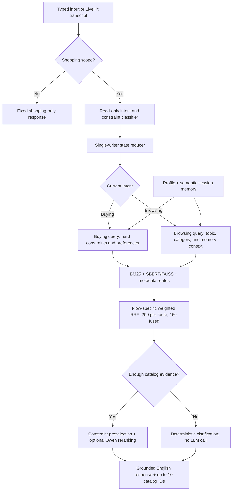

# NAmazon — Voice-First Conversational Product Search

Build an AI shopping agent that asks useful follow-up questions and recommends the customer's hidden target product within at most 10 turns.

## Project Overview

**NAmazon** is a voice-first conversational shopping assistant for customers who
either know what they want (**Buying**) or want help discovering a direction
(**Browsing**). It combines hybrid catalog retrieval, semantic conversation
memory, evidence-gated clarification, optional Qwen reranking, microphone
speech-to-text, and a speaking Wav2Lip avatar. The agent does not hallucinate a
recommendation when the request is vague: it asks for the missing product scope
first, and it returns a fixed boundary response for unrelated requests.

The official evaluator-facing component is the deterministic `Agent` interface.
The web UI, voice stack, anonymous demo memory, image previews, and avatar are
optional demonstration layers and do not change the frozen-catalog scoring
contract.

Submission-ready written copy is available in
[`DEVPOST_SUBMISSION.md`](DEVPOST_SUBMISSION.md). Replace its bracketed GitHub,
demo, and remaining team fields before submitting. The planned public repository
is [Levi3110/TiktokTechjam-2026](https://github.com/Levi3110/TiktokTechjam-2026).

## What You Receive

- A frozen catalog of 50,000 products from the `Clothing_Shoes_and_Jewelry` category of Amazon Reviews 2023.
- 200 labeled public sessions for local development.
- A weak BM25 starter agent and deterministic local evaluator.
- The Agent API contract and scoring rules.

The organizer keeps 800 additional sessions private for final evaluation.

## Task

For each session, your agent receives an anonymized preference profile and a short customer message. Raw user IDs, review text, timestamps, and purchase history are never disclosed. On every turn the agent may:

- ask a natural clarification question in `message` and identify one requested field in `ask_attribute`;
- return a ranked list of up to 10 catalog `parent_asin` values;
- do both in the same response.

The session ends when the target product appears in the scored Top 10 or after turn 10. Sessions cover Buying, Browsing, Intent Override, and Boundary behavior.

## Download the Catalog

Download `catalog.jsonl.gz` from the GitHub Release attached to this repository, then run:

```bash
gzip -dk catalog.jsonl.gz
mv catalog.jsonl data/catalog.jsonl
```

Verify the downloaded file using the published `SHA256SUMS` file.

## Run the Starter

Python 3.10 or later is recommended. Install `requirements.txt` before running
the implemented agent.

```bash
python3 -m evaluator.local_evaluator
```

Edit `starter/agent.py` to implement your system. Do not edit the evaluator or public labels when reporting your local score.
The command writes per-session results and aggregate metrics to `results.json`.

## Implemented Agent

The starter in this workspace has been upgraded to a full two-flow RAG agent:



The complete runtime, state, Buying, Browsing, voice, confirmation, and fallback
workflow is documented in [`docs/WORKFLOW.md`](docs/WORKFLOW.md).

- `starter/retrieval.py` builds BM25 and multilingual SBERT vectors for the 50,000-row catalog. Vectors are cached in `.cache/`; FAISS performs dense search. Each route retrieves 200 candidates before flow-specific weighted-RRF fusion, and budget is a soft preference rather than a destructive hard filter.
- `starter/memory.py` stores anonymized profile context, conversation turns, constraints, asked fields, intent overrides, and retrieves relevant memories semantically. An early broad question can fill multiple requirement slots from one voice answer.
- `starter/qwen_ranker.py` reranks the candidate pool through a private
  OpenAI-compatible `qwen3.6-27b` vLLM endpoint. A circuit breaker falls back to
  weighted RRF when the model is unavailable.
- `starter/agent.py` is the supervisor and preserves the official `reset/respond` interface.
- The supervisor calls Qwen only after retrieval finds catalog evidence for a
  concrete product/category signal. Vague shopping requests receive one
  clarification question with no speculative recommendations. Unrelated turns
  receive the fixed shopping-only boundary response and are not written into
  product memory.

With Qwen disabled to isolate retrieval quality, the implemented agent scores
Hit Rate@10 `0.675`, MRR `0.412635`, MTTC `4.815`, and Technical Score
`0.58499` on all 200 public sessions. The deterministic run is saved to
`results.json` (which is gitignored).

With Qwen enabled, the same 200-session evaluator scores Hit Rate@10 `0.69`,
MRR `0.481871`, MTTC `4.865`, and Technical Score `0.612261`. Qwen reports
`2,494,783` prompt tokens and `76,797` completion tokens (`2,571,580` total).
The complete sequential run takes `5,542.40` seconds (`92.373` minutes), or
`27.712` wall-clock seconds per session on average. These aggregate measurements
are stored in [`docs/qwen_results.json`](docs/qwen_results.json).

Install and configure:

```bash
python3 -m venv .venv
source .venv/bin/activate
pip install -r requirements.txt
cp .env.example .env
```

The first real run downloads the SBERT model and builds the dense catalog cache. To test without model/network startup cost:

```bash
TECHJAM_ENABLE_SBERT=false QWEN_RERANK_ENABLED=false pytest -q
```

Configure the private Qwen endpoint only in the gitignored `.env` file:

```dotenv
QWEN_BASE_URL=http://YOUR_QWEN_HOST:8000/v1
QWEN_MODEL=qwen3.6-27b
```

Run an interactive terminal demo:

```bash
.venv/bin/python demo.py
```

Use `/reset` to clear conversational memory and `/quit` to exit. A one-shot
test is also available with `--message "your shopping request"`.

## Run the Full NAmazon Stack

NAmazon uses three local server processes. Start them in this order:

1. **LiveKit** receives browser microphone audio over WebRTC.
2. **LiveTalking** generates the assistant voice over WebRTC.
3. **NAmazon Web** serves both the frontend and backend API, runs the shopping
   agent, and starts a Faster-Whisper worker for each microphone session.

### Start everything with one command (recommended)

After completing the one-time installation below, do not open three terminals.
Run this single command from the project directory:

```bash
.venv/bin/python run_namazon.py
```

The supervisor starts LiveKit (`7880`), waits for it, starts LiveTalking
(`8010`), then starts the combined frontend/backend (`8765`). It opens
`http://127.0.0.1:8765/` automatically. Press `Ctrl+C` once in that terminal to
stop every service started by the supervisor.

On macOS, you can alternatively double-click `start_namazon.command`. If macOS
does not allow it to run yet, execute this once:

```bash
chmod +x chmod +x start_namazon.command
./start_namazon.command
```

Use `--no-browser` when you do not want the browser to open automatically:

```bash
.venv/bin/python run_namazon.py --no-browser
```

### First-time setup

Install LiveKit on macOS:

```bash
brew install livekit
```

Prepare the NAmazon Python environment:

```bash
python3 -m venv .venv
.venv/bin/pip install -r requirements.txt
```

Download the multilingual Whisper model once. The runtime intentionally uses
local files only after setup so a microphone session never downloads a model:

```bash
.venv/bin/python -c "from faster_whisper import WhisperModel; WhisperModel('base', device='cpu', compute_type='int8', download_root='.models/faster-whisper')"
```

Clone the tested LiveTalking upstream as a sibling of this project, then prepare
its environment:

```bash
cd ..
git clone https://github.com/lipku/LiveTalking.git
cd LiveTalking
git checkout c4f8c16a86bdc4d217782cac52fb431dc5bca7b0
python3 -m venv .venv
.venv/bin/pip install -r requirements.txt
```

LiveTalking also requires these local assets:

```text
<workspace>/LiveTalking/models/wav2lip.pth
<workspace>/LiveTalking/data/avatars/namazon_ai_face/
```

The selected avatar is configured in `LiveTalking/config.yaml`:

```yaml
model: wav2lip
avatar_id: namazon_ai_face
transport: webrtc
listenport: 8010
```

### Manual startup and troubleshooting (optional)

The commands below are only needed when debugging an individual service.

#### Terminal 1 — start LiveKit

Keep this terminal open:

```bash
cd "<workspace>/techjam-conversational-search-main"
livekit-server --dev
```

Expected addresses:

```text
WebSocket/signalling: ws://127.0.0.1:7880
WebRTC TCP media:     127.0.0.1:7881
WebRTC UDP media:     127.0.0.1:7882
Development key:      devkey
Development secret:   secret
```

#### Terminal 2 — start LiveTalking

Open a second terminal and keep it open:

```bash
cd "<workspace>/LiveTalking"
.venv/bin/python app.py
```

Wait until the terminal prints:

```text
start http server; http://<serverip>:8010
```

LiveTalking endpoints used by the frontend:

```text
POST http://127.0.0.1:8010/offer   Create the assistant WebRTC session
POST http://127.0.0.1:8010/human   Convert an answer to assistant speech
```

#### Terminal 3 — start the frontend and backend

Open a third terminal and keep it open:

```bash
cd "<workspace>/techjam-conversational-search-main"
.venv/bin/python web_demo.py --host 127.0.0.1 --port 8765
```

Catalog loading can take several seconds. Wait until the terminal prints:

```text
Open http://127.0.0.1:8765
```

Open the application in Google Chrome:

```bash
open -a "Google Chrome" "http://127.0.0.1:8765"
```

The frontend and backend share port `8765`:

```text
GET  http://127.0.0.1:8765/                       NAmazon frontend
GET  http://127.0.0.1:8765/api/health             Service health
POST http://127.0.0.1:8765/api/chat               Agent/RAG response
POST http://127.0.0.1:8765/api/selection          Product/size confirmation
GET  http://127.0.0.1:8765/api/product/image      Cached confirmed-product image
POST http://127.0.0.1:8765/api/livekit/token      Microphone room token
GET  http://127.0.0.1:8765/api/livekit/transcript Speech-to-text result
```

### Remembered behavior and product confirmation

The web demo assigns an anonymous ID to the browser in `localStorage`. A
confirmed product and size are written to `.cache/user_behavior.json`; up to 20
recent confirmations are retained per browser. When that browser starts a new
chat session, its recent products, most selected category, and most selected
size are added to the profile semantic memory used by retrieval/RAG. No name,
email, raw microphone audio, or account identifier is stored.

Each recommendation has a **Choose this** action. The demo then asks for a
size and shows **Confirm this choice**. Confirmation records a strong preference
signal, looks up a product image with DDG image search, downloads a bounded copy
to `.cache/product_images/`, and displays the local cached image in the chat.

Image lookup is optional and never changes the official `Agent.respond(...)`
recommendation IDs or scoring. It requires internet access, fails closed to an
offline placeholder, and can be disabled explicitly:

```bash
NAMAZON_WEB_IMAGE_SEARCH=false .venv/bin/python web_demo.py --host 127.0.0.1 --port 8765
```

Deleting `.cache/user_behavior.json` clears the demo's remembered browser
behavior. Deleting `.cache/product_images/` clears downloaded previews.

### Microphone permission

Use Chrome directly rather than the VS Code embedded preview. On the first mic
press, select **Allow while visiting the site**.

If Chrome reports that permission is blocked:

1. Open `chrome://settings/content/siteDetails?site=http%3A%2F%2F127.0.0.1%3A8765`.
2. Set **Microphone** to **Allow**.
3. Open macOS **System Settings → Privacy & Security → Microphone**.
4. Enable **Google Chrome**.
5. Return to NAmazon and press `Cmd + Shift + R`.

The microphone is push-to-talk: press once to start, speak after the UI says
**Listening**, and press again to stop. Faster-Whisper detects English or
Vietnamese and places the transcript into the conversation.

### Request flow

```text
Browser microphone
  -> LiveKit ws://127.0.0.1:7880
  -> Faster-Whisper base
  -> Backend http://127.0.0.1:8765/api/chat
  -> BM25 + FAISS + memory RAG + Qwen ranking
  -> LiveTalking http://127.0.0.1:8010/human
  -> AI audio + audio-reactive egg mouth
```

Qwen ranking requires `QWEN_BASE_URL` from the gitignored `.env` file. If it is
missing or the endpoint is unavailable, the agent continues with its
weighted-RRF fallback. Never commit the private endpoint or API key.

### Verify all servers

```bash
curl http://127.0.0.1:8765/api/health
curl -I http://127.0.0.1:8010/
lsof -nP -iTCP:7880 -iTCP:8010 -iTCP:8765 -sTCP:LISTEN
```

Expected web health response:

```json
{"status":"ok","products":50000,"livekit_url":"ws://127.0.0.1:7880"}
```

### Stop the stack

Press `Ctrl+C` once in each of the three server terminals. If a port is already
in use during the next startup, locate the old process before stopping it:

```bash
lsof -nP -iTCP:7880 -iTCP:8010 -iTCP:8765 -sTCP:LISTEN
kill <PID>
```

The evaluator still requires the organizer-provided `data/catalog.jsonl`; it is intentionally not stored in this repository.

The included weak BM25 starter scores Hit Rate@10 `0.125`, MRR `0.068034`, and
MTTC `9.81` on the released public set. See `docs/baseline_results.json`.

## Agent Interface

```python
class Agent:
    def reset(self, session_id: str, user_profile: dict) -> None:
        ...

    def respond(self, session_id: str, user_message: str, turn: int, top_k: int) -> dict:
        return {
            "message": "Do you have a material preference?",
            "ask_attribute": "material",
            "recommendations": [
                {"parent_asin": "B000..."},
                {"parent_asin": "B001..."}
            ],
            "usage": {"prompt_tokens": 120, "completion_tokens": 30}
        }
```

`ask_attribute` is one of `category`, `material`, `color`, `size`, `style`, `brand`, `budget`, `feature`, `use_case`, `other`, or `null`. See `docs/agent_api_contract.json`.

## Technical Metrics

- **Hit Rate@10:** fraction of sessions that find the target within 10 turns.
- **MRR:** mean reciprocal rank of the target; a miss contributes zero.
- **MTTC:** mean first-hit turn; a miss is assigned turn 11.
- **Reported token usage:** prompt and completion tokens returned by the team's model client.

```text
TechnicalScore = 0.50 × HitRate@10 + 0.30 × MRR + 0.20 × Efficiency
Efficiency = clip((11 - MTTC) / 10, 0, 1)
```

`TechnicalScore` is an objective input to the `Technical Execution` assessment. It is not a separate judging criterion and does not represent the entire `Technical Execution` score.

## Reproduce the Reported Results

The reported result uses the 200 public sessions, the full 50,000-product
catalog, multilingual SBERT/FAISS retrieval, and deterministic weighted-RRF
ranking with Qwen disabled. From a completed installation, run:

```bash
QWEN_RERANK_ENABLED=false .venv/bin/python -m evaluator.local_evaluator
```

The evaluator writes detailed per-session output to the gitignored
`results.json`. The expected aggregate metrics are stored in
[`docs/namazon_results.json`](docs/namazon_results.json):

```text
Hit Rate@10:    0.675
MRR:            0.412635
MTTC:           4.815 turns
TechnicalScore: 0.58499
```

The first-turn route diagnostic is stored in
[`docs/retrieval_diagnostics.json`](docs/retrieval_diagnostics.json). Re-run it
to compare BM25, SBERT/FAISS, metadata, and fused recall at several cutoffs:

```bash
QWEN_RERANK_ENABLED=false .venv/bin/python scripts/retrieval_diagnostics.py
```

Run the Qwen-enabled evaluation and collect real model usage with:

```bash
QWEN_RERANK_ENABLED=true .venv/bin/python -m evaluator.local_evaluator --output results-qwen.json
```

The measured Qwen-enabled aggregate is:

```text
Hit Rate@10:       0.69
MRR:               0.481871
MTTC:              4.865 turns
TechnicalScore:    0.612261
Prompt tokens:     2,494,783
Completion tokens: 76,797
Total tokens:      2,571,580
Full-suite time:   5,542.40 seconds (200 sequential multi-turn sessions)
Average time:      27.712 wall-clock seconds per session
```

Run the regression suite separately:

```bash
TECHJAM_ENABLE_SBERT=false QWEN_RERANK_ENABLED=false .venv/bin/python -m pytest -q
```

## Development Tools, APIs, and Libraries

| Area | Technology | Use in NAmazon |
|---|---|---|
| Development | VS Code, macOS Terminal, Python 3.10+ | Implementation, local debugging, and process supervision |
| Sparse retrieval | `rank-bm25` | Exact lexical and product-attribute matching |
| Dense retrieval | Sentence Transformers and FAISS | Multilingual embeddings and semantic catalog search |
| Ranking | Qwen `qwen3.6-27b` through a private OpenAI-compatible vLLM endpoint | Optional candidate reranking and grounded response wording |
| Numeric/runtime | NumPy and PyTorch | Vector operations and local model inference |
| Speech input | LiveKit and Faster-Whisper | Browser WebRTC microphone transport and local English/Vietnamese transcription |
| Talking avatar | LiveTalking, Wav2Lip, Edge TTS, `aiohttp`, and `aiortc` | WebRTC avatar video, lip synchronization, and English assistant audio |
| Product preview | DuckDuckGo image results and `truststore` | Optional post-confirmation image lookup with an offline placeholder |
| Testing/config | pytest and python-dotenv | Regression tests and secret-free environment configuration |

The `openai` Python package is used only as an OpenAI-compatible client for the
self-hosted Qwen endpoint; NAmazon does not require an OpenAI-hosted model.

## Datasets and Assets

- **Amazon Reviews 2023** by McAuley Lab, UCSD, category
  `Clothing_Shoes_and_Jewelry`.
- A frozen **50,000-product** text/metadata catalog keyed by `parent_asin`.
- **200 labeled public development sessions** across Buying, Browsing, Intent
  Override, and Boundary scenarios. The 800 private sessions are never included.
- Participant-visible aggregate preference profiles; raw user IDs, raw reviews,
  purchase timestamps, and private purchase histories are excluded.
- The multilingual Sentence Transformers checkpoint, Faster-Whisper `base`
  checkpoint, Wav2Lip checkpoint, vendored LiveKit browser client, and a
  preprocessed custom still avatar used only for the interactive demo.

See [`DATA_ATTRIBUTION.md`](DATA_ATTRIBUTION.md) for the source attribution and
usage notice. Large catalog/model files are intentionally excluded from Git and
must be downloaded during setup.

## Limitations and Future Improvements

- The official catalog covers clothing, shoes, and jewelry only; this is not a
  general-purpose or live Amazon search engine.
- Product prices, size availability, inventory, checkout, and order placement
  are not connected to a retailer API. Demo confirmation is not a transaction.
- The Qwen endpoint is private and optional. Network/model outages fall back to
  weighted RRF, which is robust but produces less natural ranking explanations.
- Product preview search can return an imperfect image and requires internet;
  offline mode shows a placeholder and does not affect recommendation IDs.
- Anonymous confirmed-product memory is local JSON keyed by a browser-generated
  ID. A production version needs encrypted storage, consent controls, retention
  policy, account synchronization, and a user-facing delete workflow.
- The heuristic scope/evidence gate should eventually be replaced or augmented
  by a calibrated classifier trained on adversarial and multilingual examples.
- CPU transcription and Wav2Lip can add latency; production work would include
  streaming ASR, GPU batching, interruption handling, and lip-sync evaluation.
- Local LiveKit development credentials and plain HTTP are suitable only for a
  localhost demo. Deployment requires TLS, real secrets, authentication, CORS
  restrictions, observability, and rate limiting.

Given more time, we would add retailer inventory APIs, grounded product-image
verification, learned fusion weights, offline/online reranker evaluation,
privacy-preserving long-term memory, accessibility testing, and production
deployment automation.

## Team Contributions

- **Levi3110 — Team Leader:** system architecture and technical direction;
  hybrid retrieval/RAG, backend integration, voice/avatar coordination, UI,
  evaluation, release preparation, and documentation.

## Public Repository Checklist

- Publish the prepared repository as
  `https://github.com/Levi3110/TiktokTechjam-2026` and verify that the URL is public.
- Do not commit `.env`, model checkpoints, caches, generated results, or the
  50,000-row catalog; their setup/download steps are documented above.
- Include all first-party source, tests, docs, `.env.example`, requirements,
  `run_namazon.py`, and `start_namazon.command`.
- Keep the upstream LiveTalking attribution and pin the tested commit documented
  in `DEVPOST_SUBMISSION.md`; do not present third-party code as team-authored.
- Keep `LICENSE` and `NOTICE`; Apache-2.0 applies only to first-party NAmazon
  code, while datasets, models, and upstream components retain their own terms.
- Run the tests, evaluator, and secret scan before creating the public release.

Only exact `parent_asin` equality produces a hit. Core metrics are also reported by scenario.

## Model Choice and Cost

The optional reranker uses a self-hosted `qwen3.6-27b` model through a private
OpenAI-compatible vLLM endpoint. The measured 200-session Qwen run reports
`2,494,783` prompt and `76,797` completion tokens. It has no per-token vendor API
charge, no paid vector database, and required no additional hardware purchase or
rental, so the observed incremental direct monetary cost was `$0`. The run used
existing development hardware; electricity and underlying infrastructure
opportunity cost were not separately estimated.

The complete sequential evaluator took `5,542.40` seconds, averaging `27.712`
wall-clock seconds per session. This is a full-suite end-to-end average, not a
per-turn p50/p95 benchmark. The offline 200-session result disables Qwen,
reports zero model tokens, and remains the network-independent fallback.

Endpoint URLs and keys must remain in the gitignored `.env`. Optional Edge TTS
and DuckDuckGo preview requests are demo dependencies, while the official agent
continues offline using weighted RRF and no product imagery.

## Files

```text
DEVPOST_SUBMISSION.md             copy-ready written Devpost submission
data/public_set.jsonl             200 labeled development sessions
docs/competition_specification.md participant rules and evaluation protocol
docs/agent_api_contract.json      machine-readable Agent contract
docs/evaluation_config.json       scoring configuration
docs/baseline_results.json        reproducible weak-starter reference score
docs/namazon_results.json         implemented-agent aggregate result
docs/qwen_results.json            Qwen metrics, tokens, latency, and cost disclosure
docs/retrieval_diagnostics.json   route-level recall measurements
docs/WORKFLOW.md                  complete Buying/Browsing and runtime workflow
starter/agent.py                  supervisor and official Agent interface
starter/retrieval.py              BM25, FAISS, filters, and rank fusion
starter/memory.py                 checkpointed semantic conversation memory
starter/qwen_ranker.py            optional grounded Qwen reranker
starter/behavior.py               anonymous demo memory and image cache
evaluator/local_evaluator.py      public-set simulator and scorer
web_demo.py                       combined frontend and backend demo server
livekit_stt_worker.py             LiveKit microphone speech-to-text worker
run_namazon.py                    one-command three-service supervisor
scripts/retrieval_diagnostics.py  BM25/SBERT/metadata/fusion recall debugger
tests/                            regression and interface tests
```

## Judging and Submission Policy

- Participant submission requirements: `docs/submission_rules.md`

## Data Source

The catalog and sessions are derived from Amazon Reviews 2023 by McAuley Lab, UCSD. See `DATA_ATTRIBUTION.md` before using or redistributing the data.
Sessions are sampled deterministically from the official Clothing 5-core leave-last-out split and joined to the frozen catalog.

## License

First-party NAmazon source code is licensed under the
[Apache License 2.0](LICENSE). See [NOTICE](NOTICE) and
[DATA_ATTRIBUTION.md](DATA_ATTRIBUTION.md) for third-party software, models,
assets, and dataset terms that are not relicensed by this repository.
