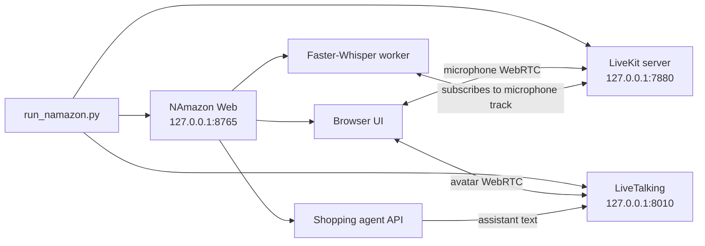
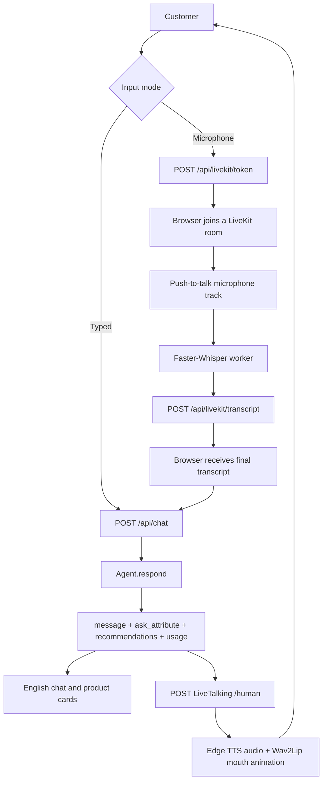
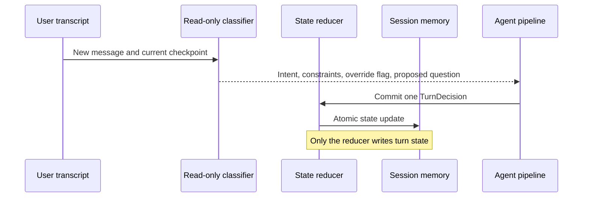
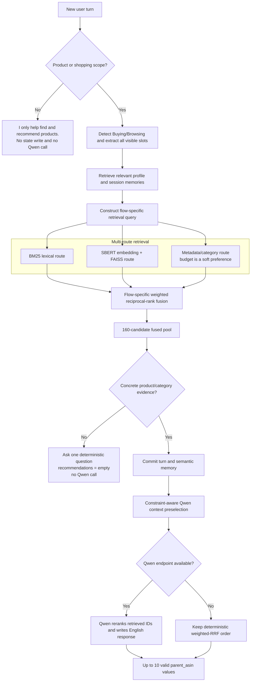
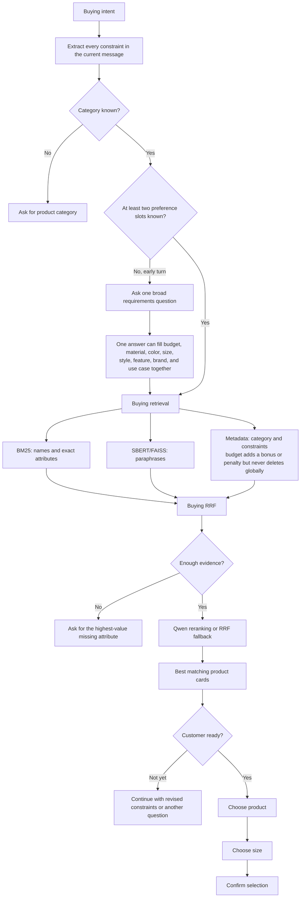
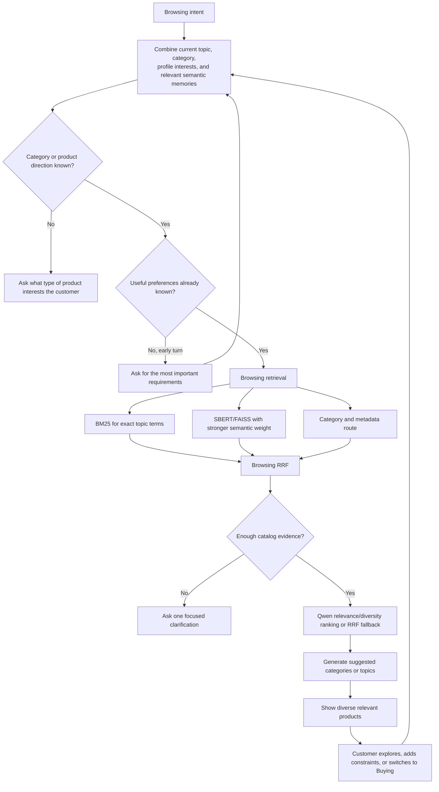
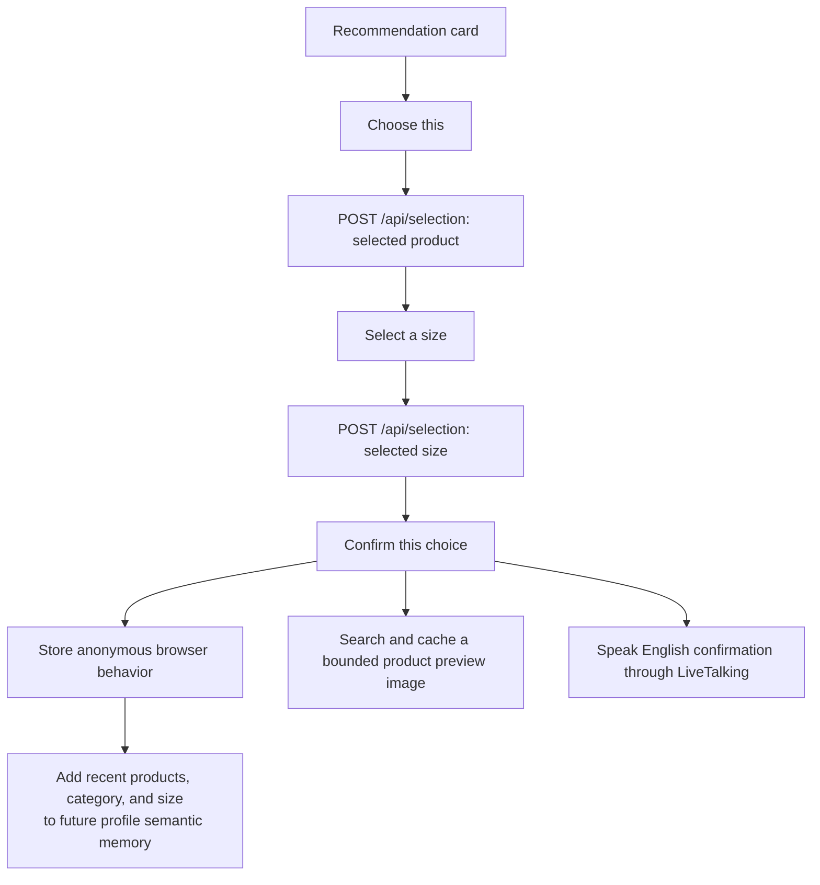

# NAmazon Complete Project Workflow

This document describes the implemented workflow of the current NAmazon codebase.
It covers process startup, typed and voice input, agent state management, Buying
and Browsing retrieval, evidence gating, Qwen reranking, deterministic fallback,
product confirmation, and behavioral memory.

## 1. Runtime Topology

The one-command supervisor starts and monitors three local services.



Startup order:

1. `run_namazon.py` starts or reuses LiveKit and waits for port `7880`.
2. It starts or reuses LiveTalking and waits for port `8010`.
3. It starts the combined frontend/backend and waits for `/api/health` on port
   `8765`.
4. It opens `http://127.0.0.1:8765/` unless `--no-browser` is supplied.
5. A single `Ctrl+C` stops every process started by the supervisor.

## 2. Input and Output Workflow



The browser microphone is push-to-talk. LiveKit transports audio; it does not
perform transcription itself. The local Faster-Whisper worker subscribes to the
room, produces the transcript, and returns it to the web backend. The resulting
text follows exactly the same `/api/chat` path as typed input.

## 3. Session State and Single-Writer Rule

Every evaluator or browser session starts with:

```python
agent.reset(session_id, user_profile)
```

The profile is converted into semantic memory. Each later call uses:

```python
agent.respond(session_id, user_message, turn, top_k)
```

State transitions are deliberately split into two phases:



The checkpoint stores the current intent, current step, constraints, previously
asked attributes, explicit no-preference fields, recent messages, semantic
memories, selected product, selected size, revision, and last processed turn.
A per-session lock prevents concurrent microphone and typed transcripts from
overwriting one another.

## 4. Shared Scope, Retrieval, and Evidence Pipeline



Each BM25, vector, and metadata branch retrieves 200 candidates before fusion.
The current parameters are:

| Flow | BM25 weight | Vector weight | Metadata weight | RRF constant |
|---|---:|---:|---:|---:|
| Buying | 0.25 | 0.50 | 2.00 | 5 |
| Browsing | 0.25 | 1.50 | 3.00 | 10 |

These values reflect route diagnostics on the public development set. Metadata
is strongest for exact catalog attributes, while the vector route remains useful
for paraphrases and exploration. The fused pool keeps 160 items. A
constraint-aware preselection orders the context sent to Qwen, but the offline
fallback preserves the measured weighted-RRF order.

## 5. Buying Workflow

Buying is selected explicitly in the UI or inferred from language such as
"buy," "need," "budget," or a hard requirement.



Important Buying behavior:

- Multiple slots are extracted from a single answer instead of asking a rigid
  sequence of one-field questions.
- Hard requirements and exact catalog matches take priority over general
  semantic similarity.
- Budget is intentionally soft because catalog price and variant metadata can
  be missing or stale.
- An intent override such as "Actually, ignore my earlier preference" keeps the
  product category, replaces conflicting preferences atomically, and reruns
  retrieval using the new requirements.

## 6. Browsing Workflow

Browsing is selected explicitly or inferred from language such as "exploring,"
"ideas," or "show me options."



Browsing emphasizes semantic relevance and category exploration. It still uses
catalog evidence and returns only real `parent_asin` identifiers. Suggested
topics come from Qwen when available or from frequent categories in the fused
candidate pool when offline.

## 7. Product Choice and Behavioral Memory

The product confirmation flow is a demonstration layer and does not change the
official evaluator interface.



The browser uses an anonymous local ID. Up to 20 recent confirmations per
browser are stored in `.cache/user_behavior.json`. No name, email, account ID,
or raw microphone audio is stored. Product preview lookup is optional and does
not affect recommendation IDs or evaluator scores.

## 8. Response Contract

Every successful agent turn returns:

```json
{
  "message": "A short grounded English response or clarification question.",
  "ask_attribute": "material",
  "recommendations": [
    {"parent_asin": "B000...", "score": 0.12345678}
  ],
  "usage": {"prompt_tokens": 120, "completion_tokens": 30}
}
```

`ask_attribute` is one of `category`, `material`, `color`, `size`, `style`,
`brand`, `budget`, `feature`, `use_case`, `other`, or `null`. Recommendations
contain only identifiers present in the frozen catalog and are capped at the
requested `top_k`, with a maximum of 10 in the implemented agent.

## 9. Failure and Fallback Behavior

| Condition | Behavior |
|---|---|
| Out-of-scope request | Return a fixed shopping-only response; do not call Qwen or write product memory. |
| Vague shopping request | Ask for product category or another useful requirement; return no recommendations. |
| Weak catalog evidence | Ask a deterministic clarification question; do not call Qwen. |
| Qwen endpoint missing | Use deterministic weighted-RRF ranking and zero LLM token usage. |
| Qwen request failure | Activate a short circuit-breaker cooldown and use weighted RRF. |
| SBERT unavailable | Use the deterministic hash-vector fallback. |
| FAISS unavailable | Use NumPy similarity over cached vectors. |
| Product image lookup failure | Show the offline placeholder; recommendation IDs remain unchanged. |
| LiveTalking unavailable | Text shopping remains usable; avatar speech is unavailable. |
| Microphone unavailable | Typed input remains usable. |

## 10. Reproduction Commands

Start the complete demo:

```bash
.venv/bin/python run_namazon.py
```

Run route diagnostics:

```bash
QWEN_RERANK_ENABLED=false .venv/bin/python scripts/retrieval_diagnostics.py
```

Run the 200-session evaluator:

```bash
QWEN_RERANK_ENABLED=false .venv/bin/python -m evaluator.local_evaluator
```

Run regression tests:

```bash
TECHJAM_ENABLE_SBERT=false QWEN_RERANK_ENABLED=false .venv/bin/python -m pytest -q
```
