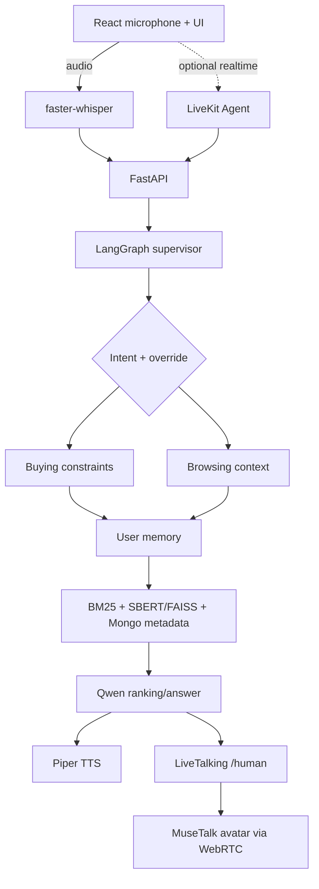

# May — Voice Commerce MVP

A voice-powered shopping assistant MVP built according to the required architecture: it accepts audio input, classifies and switches intent between **buying / browsing**, uses LangGraph for orchestration, performs hybrid retrieval with BM25 + semantic search + metadata, maintains user memory, generates responses with Qwen, synthesizes speech with Piper, and sends content to LiveTalking/MuseTalk.

The application can run in **demo mode** without an API key or heavyweight models. Production adapters can be enabled through environment variables.

## Architecture



## Quick Start

Recommended requirements: Python 3.11 or 3.12, Node.js 20+, and npm.

```bash
cd voice-commerce
cp .env.example .env

cd backend
python3 -m venv .venv
source .venv/bin/activate
pip install -r requirements.txt
uvicorn app.main:app --reload --port 8000
```

Open a second terminal:

```bash
cd voice-commerce/frontend
npm install
npm run dev
```

Visit `http://localhost:5173`. Text chat and hybrid retrieval work immediately. Voice input requires the AI packages described below.

Alternatively, run the frontend, backend, and MongoDB services with Docker:

```bash
cp .env.example .env
docker compose up --build
```

## Enabling AI Components

### Qwen

By default, the backend uses the same Qwen/vLLM configuration declared in `../qwen_chat.py`:

```dotenv
QWEN_MODE=local
QWEN_BASE_URL=http://172.21.25.98:8000/v1
QWEN_MODEL=qwen3.6-27b
QWEN_API_KEY=not-needed-for-local-vllm
```

The server does not require an API key, but the OpenAI-compatible client still sends a placeholder value. Set `QWEN_MODE=demo` to run offline.

You can test the model independently with:

```bash
backend/.venv/bin/python ../qwen_chat.py "Hello"
```

### faster-whisper, SBERT/FAISS, and MongoDB

```bash
cd backend
pip install -r requirements-ai.txt
```

Set `ENABLE_SBERT=true`.

On the first run, sentence-transformers downloads the model specified in `SBERT_MODEL`, embeds the entire `app/data/products.json` catalog, and FAISS then uses cosine similarity for queries from the frontend.

If `MONGODB_URI` is configured, the sample catalog is automatically seeded into the `products` collection. If MongoDB is unavailable, the backend automatically falls back to the JSON catalog stored in the repository.

Statements that express user habits or preferences, such as “I like...”, “I usually...”, “I prefer...”, or “my budget is...”, are also embedded.

Vector memories are isolated by `user_id`, retrieved semantically in later turns, and passed to the Qwen prompt together with the Top-K products.

The frontend maintains a stable anonymous `user_id` in `localStorage`, while MongoDB allows memory to persist across application restarts.

### Piper

Install the Piper CLI and download a Vietnamese voice model, then configure:

```dotenv
PIPER_BINARY=piper
PIPER_MODEL=/absolute/path/to/vi_VN-model.onnx
```

If Piper is not configured, the UI automatically falls back to the browser's Speech Synthesis API.

### LiveTalking + MuseTalk

The LiveTalking repository is available at `../LiveTalking`.

Prepare the avatar and models according to that repository's README, then run it, for example:

```bash
cd ../LiveTalking
python app.py --transport webrtc --model musetalk --avatar_id <avatar-id>
```

Keep:

```dotenv
LIVETALKING_URL=http://localhost:8010
```

Open the UI and click **Connect Avatar**.

The backend proxies the WebRTC offer to `/offer`, stores the `sessionid`, and then sends each response to `/human` with `type=echo`, allowing the avatar to speak and perform lip synchronization.

### LiveKit Agents (Optional)

The default flow uses:

```text
MediaRecorder → /api/transcribe
```

so a realtime account is not required.

The `backend/livekit_agent.py` file provides an alternative transport worker. LiveKit receives realtime audio and, once STT is complete, calls the same LangGraph supervisor.

```bash
cd backend
pip install -r requirements-livekit.txt

export LIVEKIT_URL=wss://<project>.livekit.cloud
export LIVEKIT_API_KEY=<key>
export LIVEKIT_API_SECRET=<secret>

python livekit_agent.py dev
```

A production LiveKit frontend integration requires a token endpoint and the LiveKit React SDK. Do not expose secrets in the browser.

## Main APIs

| Method | Endpoint                        | Purpose                                     |
| ------ | ------------------------------- | ------------------------------------------- |
| `POST` | `/api/sessions`                 | Create a session and set the initial intent |
| `POST` | `/api/chat`                     | Run the complete supervisor graph           |
| `GET`  | `/api/users/{user_id}/memories` | Inspect stored user habits/preferences      |
| `POST` | `/api/transcribe`               | Audio → faster-whisper                      |
| `POST` | `/api/tts`                      | Text → Piper WAV                            |
| `POST` | `/api/avatar/offer`             | Proxy a WebRTC offer to LiveTalking         |
| `POST` | `/api/avatar/speak`             | Send a response to the avatar               |
| `GET`  | `/api/health`                   | Check demo/Qwen and semantic backend status |

Example chat request:

```bash
SESSION=$(curl -s -X POST http://localhost:8000/api/sessions \
  -H 'content-type: application/json' \
  -d '{"user_id":"demo","initial_intent":"browsing"}' | python -c 'import json,sys; print(json.load(sys.stdin)["session_id"])')

curl -s -X POST http://localhost:8000/api/chat \
  -H 'content-type: application/json' \
  -d "{\"session_id\":\"$SESSION\",\"message\":\"I want to buy a laptop under 18 million VND\"}"
```

## Supervisor Workflow

1. `detect_intent`: Rule-first intent detection; explicit language can override the current workflow.

2. `buying_flow` / `browsing_flow`: Extract hard constraints or soft discovery context.

3. `capture_memory`: Detect statements describing user habits or preferences, generate embeddings, and store them by user.

4. `load_memory`: Perform semantic search over relevant preferences stored in FAISS/MongoDB.

5. `retrieve`: Apply metadata prefiltering, BM25 + SBERT/FAISS retrieval, and reciprocal-rank fusion.

6. `respond`: Qwen receives the query, semantic memory, constraints, and Top-K products.

7. `persist`: Store conversation history and the current intent.

## Testing

```bash
cd backend
pip install -e '.[test]'
pytest -q
```

The tests cover intent override, Vietnamese budget extraction, metadata filtering, retrieval fallback, and execution paths through LangGraph.
